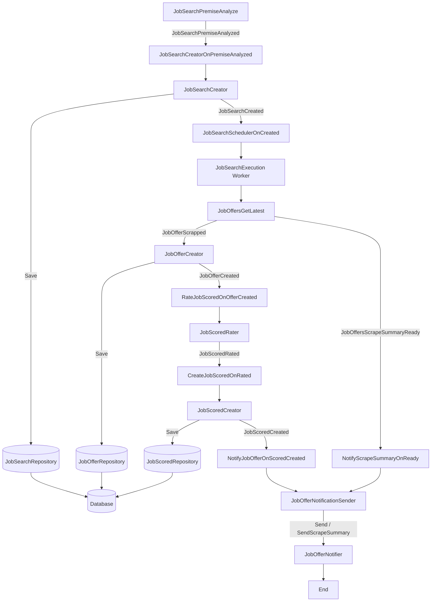

# Event Flow

This document shows the event flow between use cases, events, the event bus, and persistence.

Notes:
- `JobSearchSchedulerOnCreated` now upserts schedulers in BullMQ (`job-search-scrape` queue) using `upsertJobScheduler(jobSearchId, ...)`.
- Job payload: `{ jobSearchId, premise, filter, datePostedPeriod, minNotificationRating }`.
- Periodicity mapping: `daily` (24h), `weekly` (7d), `biweekly` (14d), `monthly` (30d).
- Unschedule operation uses `removeJobScheduler(jobSearchId)`.
- `JobOffersGetLatest` publishes `JobOfferScrapped[]` and one `JobOffersScrapeSummaryReady` event per execution.
- `NotifyScrapeSummaryOnReady` computes how many scraped links reached `minNotificationRating` and sends a summary notification.
